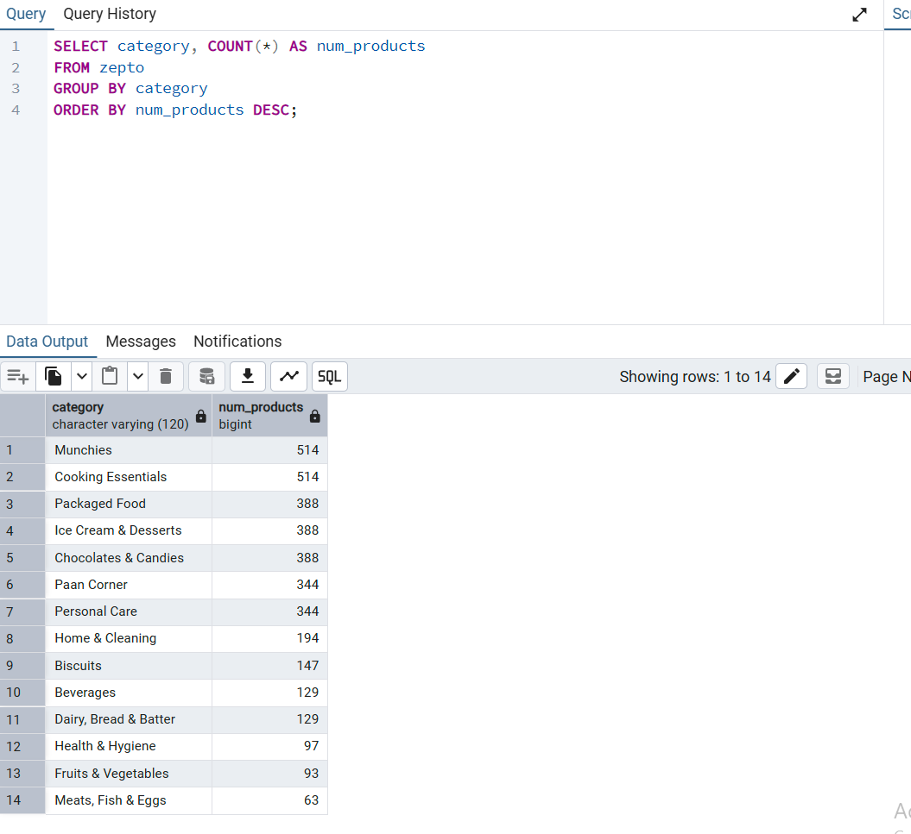

# Zepto Inventory — SQL Analysis

Analysis of 3,732 SKUs from **Zepto** (Indian quick-commerce platform) using PostgreSQL 18.

## 📊 Project Overview

This project explores product inventory data to answer key business questions about stock distribution, pricing strategy, and restocking priorities. The dataset contains real product data across 14 categories including Munchies, Cooking Essentials, Personal Care, and more.

## 🛠️ Tools

- **PostgreSQL 18** — database
- **pgAdmin 4** — interface
- **Dataset:** [Kaggle — Zepto Inventory](https://www.kaggle.com/)

## 🔍 Key Insights

| Metric | Value |
|--------|-------|
| Total products | **3,732** |
| Categories | **14** |
| In stock | 3,279 (87.9%) |
| Out of stock | 453 (12.1%) |

### Detailed Findings

1. **Largest categories by product count:**
   - Munchies: 514 products
   - Cooking Essentials: 514 products
   - Packaged Food: 388 products

2. **Highest inventory value:**
   - Cooking Essentials: ₹33.7M
   - Munchies: ₹33.7M
   - Personal Care: ₹27.1M

3. **Discount strategy:**
   - Fruits & Vegetables have the highest average discount (15.46%) — perishable goods
   - Personal Care has the lowest (6.25%) — long shelf life

4. **Value per gram:**
   - Personal Care: ₹185/gram (highest)
   - Cooking Essentials: ₹83.59/gram
   - Fruits & Vegetables: lowest

5. **Restocking urgency:**
   - 12+ products have only 1 unit left in stock
   - All urgent items are in Cooking Essentials category

## 📁 Files

- `schema.sql` — database table definition
- `queries.sql` — 8 SQL analysis queries
- `README.md` — this file

## 🚀 How to Reproduce

1. Install PostgreSQL 18
2. Create database `zepto_analysis`
3. Run `schema.sql` to create the table
4. Import CSV data (see comments in `schema.sql`)
5. Run queries from `queries.sql`

## 👤 Author

**Mihail Serban-Udescu**
- GitHub: [@mihail-serban-udescu](https://github.com/mihail-serban-udescu)
- Looking for Junior Data Analyst roles

---

*Project built as part of a data analytics portfolio.*
